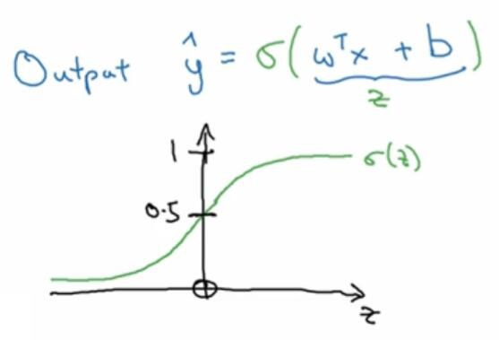
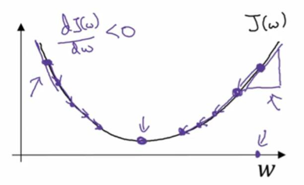
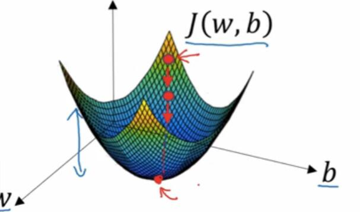

# 1.2 logistic 回归

> 视频：[第二周 神经网络基础](https://mooc.study.163.com/learn/deeplearning_ai-2001281002?tid=2001392029)

> 整理：[飞龙](https://github.com/wizardforcel)

logistic 回归属于广义线性回归。所谓广义线性回归，就是在线性回归的模型上加一些东西，使其适应不同的任务。

logitic 回归虽然名字里有回归，但是它解决的是二元分类问题。二元分类问题中，标签只有两个值。一个典型的二元分类是输入一张图片，判断是不是猫。

首先来看假设，我们的假设是这样的：

$$
P(y=1 | x) = \sigma(\theta^T x)
$$

某个样本 $(x,y)$ 是正向分类的概率是 $x$ 乘权重 $\theta$ 再套个 sigmoid 函数，非常简单。这两个东西都是列向量。

sigmoid 函数用 $\sigma(x)$ 表示，图像是 S 型的，值域是 $(0,1)$，正好符合概率的要求。它的导数用函数值来表达更加方便，$\frac{d\sigma}{dx} = \sigma(1-\sigma)$。



> 注：

> 我的习惯是，把 $w$（权重）和 $b$（偏置）打包在一起，称为 $\theta$，因为这样节省很多计算。而且易于扩展，如果你需要偏置项，给 $w$ 多加一项，给 $x$ 添加一个 $1$，如果不需要，保持原样即可。

为了找出最优的 $\theta$，像通常一样，我们需要一个损失函数，然后使其最小。

$$
z = \theta^T x \\\\
a = \sigma(z) \\\\
l = - y \log(a) - (1-y) \log(1-a)
$$

这个函数为什么能用，需要解释一下。当 $y$ 是 $1$ 的时候，$l = -\log(a)$。如果我们要使 $l$ 最小，就是使 $a$ 最大。因为 sigmoid 函数最大值为 $1$，所以实际上，我们使 $a$ 接近 $1$。

当 $y$ 是 $0$ 的时候，$l = -\log(1-a)$。同理，我们使 $a$ 最小，因为 sigmoid 函数最小值为 $0$，就是使 $a$ 接近 $0$。

无论如何，我们都使 $a$ 尽可能接近 $y$。

我们需要一个大的损失函数，衡量模型在所有样本上的表现。我们用 $x^{(i)}$ 表示第 $i$ 个样本的特征。

$$
J = - \sum_i(y^{(i)} \log(a^{(i)}) + (1-y^{(i)}) \log(1-a^{(i)}))
$$

然后我们需要求 $J$ 对 $\theta$ 的导数。

$$
\frac{dJ}{da^{(i)}} = \frac{1-y^{(i)}}{1-a^{(i)}} - \frac{y^{(i)}}{a^{(i)}} \\\\
\frac{da^{(i)}}{dz^{(i)}} = a^{(i)}(1-a^{(i)})\\\\
\frac{dz^{(i)}}{d\theta} = x^{(i)} \\\\
\frac{dJ}{dz^{(i)}} = a^{(i)} - y^{(i)} \\\\
\frac{dJ}{d\theta} = \sum_i((a^{(i)} - y^{(i)}) x^{(i)})
$$

> 注：

> （1）如果你拆成了 $w$ 和 $b$，那么 $\frac{dJ}{db}$ 就是 $\sum_i \frac{dJ}{dz^{(i)}}$，$\frac{dJ}{dw}$ 和 $\frac{dJ}{d\theta}$ 一样。

> （2）所有导数以及 $J$ 都需要除以 $n_{data}$，但为了简洁我省略了，下同。

> （3）在机器学习（以及数值计算）中，没有必要区分导数和偏导数，导数可以看出偏导数的一元特例。所以这里我都使用了导数的符号。

我们可以看到最终的导数和线性回归一样，仍然是损失乘以特征再求和。

## 向量化

我的习惯是，将 $x^{(i)}$ 按行堆叠变成 $X$，也就是行是样本，列是特征，和咱们能够获得的绝大多数数据集一致。

$$
X = \begin{bmatrix} \vdots  \\\\ - \ x^{(i)} \ - \\\\  \vdots \end{bmatrix} \\\\
 = \begin{bmatrix} & | & \\\\ \cdots & x_j & \cdots \\\\ & | & \end{bmatrix}
$$

由于 $X$ 按行堆叠，我们需要把它放在矩阵乘法的左边。这样出来的 $Z$ 也是按行堆叠的。

$$
Z = X \theta \\\\
= \begin{bmatrix} \vdots  \\\\  z^{(i)} \\\\  \vdots \end{bmatrix}
$$

$A$ 相当于对 $Z$ 的每个元素应用 sigmoid 函数，也是类似的结构：

$$
A = \sigma(Z) \\\\
= \begin{bmatrix} \vdots  \\\\  a^{(i)} \\\\  \vdots \end{bmatrix}
$$

接下来是损失函数 $J$：

$$
J = - Sum(Y \ast \log(A) + (1 - Y) \ast \log(1 - A))
$$

其中 $\ast$ 表示逐元素相乘。

接下来是导数：

$$
\frac{dJ}{dZ} = A - Y
$$

这个还是比较好求的。

$$
\frac{dZ}{d\theta} = X \\\\
\frac{dJ}{d\theta} = X^T(A - Y)
$$

这里有一个方法，就是核对矩阵的维数。我们已经知道 $\frac{dJ}{d\theta}$ 是两个导数相乘，并且 $\frac{dJ}{dZ}$ 是`n_data x 1`的矩阵，$\frac{dZ}{d\theta}$ 是`n_data x x_feature`的矩阵，$\frac{dJ}{d\theta}$ 是`n_feature x 1`的矩阵。根据矩阵乘法，它只能是 $X^T(A - Y)$。

> 注：

> 严格来讲，向量化的导数应该称为梯度。这个笔记中不区分这两个术语。

## 梯度下降法

在代数中，如果我们需要求出一个凸函数的最值，我们可能会使导数等于 0，然后解出方程。但在机器学习中，我们使用梯度下降法来求凸函数的最值。

梯度下降法是，对于每个自变量 $x$，迭代执行以下操作：

$$
x := x - \alpha \frac{dy}{dx}
$$

其中 $\alpha$ 是学习率，一般选取 0 ~ 1 之间的值。

下面直观地解释一下。这是一个一元函数，它的形状是一个碗，或者山谷。



我们可以随便选一个点作为初始值。你可以选`0`，也可以选`1`或者随机值。这个无所谓，因为函数是凸的，沿任意路径下降都会达到全局最优值。

如果你的初始值在右侧，那么导数为正，减去它的一部分相当于向左移动了一小步。如果你的初始值在左侧，导数为负，减去它的一部分相当于向右移动了一小步。总之，这样会使 $x$ 向着全局最优的方向移动。



多元的凸函数是这样。如果你的每个自变量都减去它的导数（梯度）的一部分，那么所有自变量就相当于向着最陡的方向移动了一小步。如果你在一个山谷中，沿着最陡的方向向下走，就会到达谷底。

## 代码

向量化的公式很容易用 NumPy 代码来表示。

```py
theta = np.random.rand(n_features, 1)

for _ in range(max_iter):
    Z = np.dot(X, theta)
    A = sigmoid(Z)
    dJ_dZ = (A - Y) / n_data
    dJ_dtheta = np.dot(X.T, dJ_dZ)
    theta -= alpha * dJ_dtheta
```
