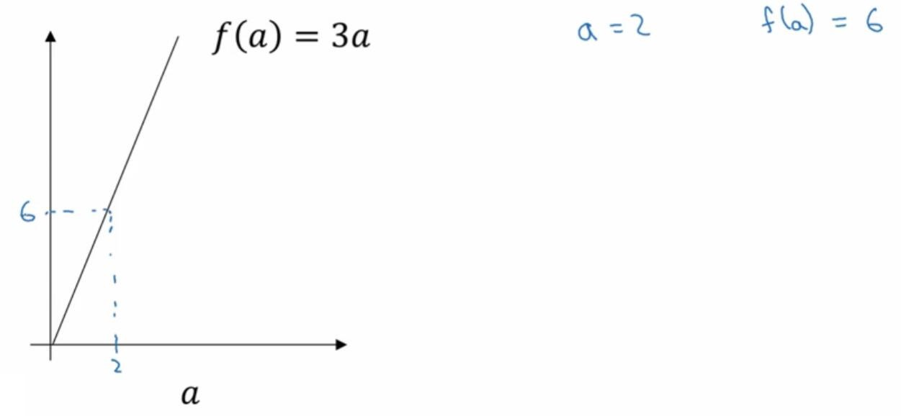
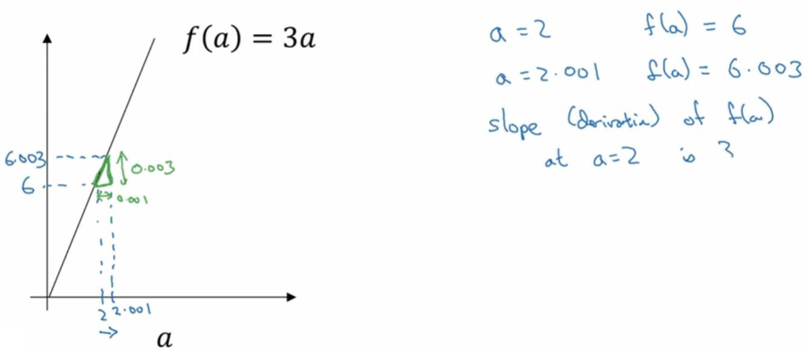
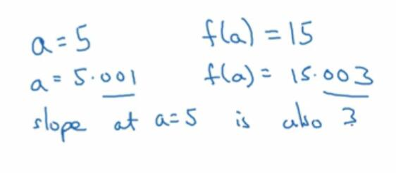

# 2.5 导数

> 视频：<https://mooc.study.163.com/learn/deeplearning_ai-2001281002?tid=2001392029#/learn/content?type=detail&id=2001702007&cid=2001694013>

在这个视频中，我想让你对微积分和导数有直观的理解。或许你认为，自从大学后你再也没有接触微积分，这取决于你什么时候毕业，也许有一段时间了。如果你顾虑这点，请不要担心，你并不需要非常深入理解微积分，就能高效应用神经网络和深度学习，因此如果你观看这个视频，或者之后视频时认为，哇喔，这些知识，这些运算对我来说真的很复杂，我给你的建议是，坚持学习视频，最好做好课后作业，成功完成编程作业，就能运用深度学习了。

事实上之后你将看到，在第4周将会定义，很多种类的函数类型，它们能够帮助你通过微积分，把所有需要的知识结合起来。其中有叫做“前向函数”，和“反向函数”的函数。你不需要了解很多微积分去使用这些函数，因此你无需担心它们超出理解范围。但在深度学习中，这周我们要一探究竟，进一步深入了解微积分的细节。但其实你只需要，对这些微积分有直观的认识，就可以构建和成功应用这些算法。

最后，如果你是为数不多的、精通微积分的同学，如果你对微积分非常熟悉，你可以跳过这个视频。其他同学，我们开始吧，一起直观了解导数。

我在这里画了一个函数，`f(a)=3a`，它是一条直线，以便直观的理解导数。让我们看看函数中几个点，假定`a=2`，那么`f(a)`等于`a`的`3`倍，等于`6`。

我们稍微改变`a`的值，只增加一点点，所以现在是`2.001`。`0.001`的差别实在太小了，不能在图中显示，我们把它右移一点。现在`f(a)`等于`a`的`3`倍，是`6.003`，画在这里。比例不太符合，这是`6.003`，你看这个小三角形，绿色高亮部分。如果我向右移动`0.001`，那么`f(a)`增加`0.003`。`f`的增加的值，是`3`倍于`a`往右移的量。因此我们说，函数`f(a)`的斜率即导数，在`a=2`处是`3`。

导数这个概念基本意味着斜率。导数听起来是个很吓人的词，但是斜率以一种很友好的方式，来描述导数这个概念。所以有时提到导数，把它当做函数的斜率就好了。

更正式的斜率定义，为高除以宽，在这个绿色小三角形中，即`0.003`除以`0.001`，斜率等于`3`，或者说导数等于`3`。这表示，当你将`a`右移`0.001`，移动一点点，`f(a)`的值将增加`3`倍于水平方向`a`的总量。这就是这条线的斜率。

现在让我们在不同点看看这个函数。假设`a=5`，此时`f(a)`是`3`乘以`a`，等于`15`。我再一次将`a`右移很小幅度，增加到`5.001`，`f(a)`等于`15.003`。同样，当我增加`a`，将`a`右移`0.001`，`f(a)`增加`3`倍，所以在`a=5`时斜率是`3`。

我们这样来写，把函数`f`的斜率写为`df(a)/da`，它等于`3`。这表示，当你轻微改变变量`a`的值，`f(a)`的斜率等于`3`。导数公式的另一个的表达方式，你可以这样写，`d/da f(a)`。不管你是否将`f(a)`放在上面，或是放在这里，都没有关系。这些等式意味着，将`a`右移一点，`f(a)`会增加`3`倍于，我移动`a`的值。

在这个视频中，我解释了导数。讨论的情况是，我们将变量`a`偏移`0.001`。如果你想知道正式的导数数学定义，导数是，你将`a`右移一个非常小的值，不是`0.001`，不是`0.00000001`，不是`0.00000..1`，非常非常小的值。导数的定义是，你将`a`右移一个不可度量的值，一个无限小的值，`f(a)`会增加一个非常非常小的值的`3`倍。也就是，在这个三角形右边的变化值。这就是导数的正式定义，但是为了直观地认识，我们探讨了，将`a`右移`0.001`这个值。尽管`0.001`并不是无穷小的可测数据。

导数的一个特性是，这个函数任何地方的斜率，总是等于`3`。不管`a=2`或`a=5`。就是说，不管`a`的值如何，如果你增加`0.001`，`f(a)`的值就增加`3`倍。这个函数在所有地方的斜率都相等，一种证明的方式是，无论你将小三角形画在哪里，它的高除以宽的比值总是`3`比`1`。

我希望给你一种感觉，什么是斜率，什么是导数。对于一条直线而言，在例子中函数的斜率，在任何地方都是`3`。在下一个视频中，我们会看一个更复杂的例子，那个函数的斜率，在不同点处都是不一样的。
