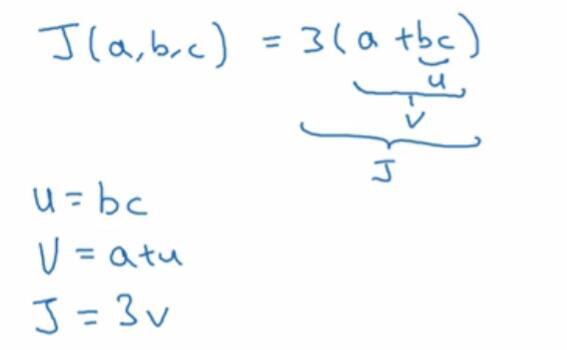

# 2.7 计算图

视频：<https://mooc.study.163.com/learn/deeplearning_ai-2001281002?tid=2001392029#/learn/content?type=detail&id=2001701011>

神经网络的计算，都是按照前向或反向传播过程来实现的。首先计算出神经网络的输出，接着是一个反向传播操作，用来计算出对应的梯度或者导数。

这一节使用一个例子来讲解正向传播。首先我们选取一个不是特别复杂的函数，`J(a,b,c)=3(a+b*c)`。为了计算这个函数，实际上有三个不同的步骤。首先是计算`b*c`，储存为`u`。然后是计算`a+u`，储存为`v`。最后是计算`3v`，输出为`J`。

我们可以把这三步，画成如下的流程图。举个例子`a=5 b=3 c=2`，`u=bc`就是`2*3=6`，`v=a+u`就是`5+6=11`。`J`是三倍的`v`，因此 `J`就等于`3*11=33`。你可以自行验证。当存在一些不同或特殊的变量时，比如`J`也是我们想要优化的东西时，这个流程图用起来很方便。

在 logistic 回归中，`J`是想要最小化的成本函数。可以看出，通过一个从左向右的过程，你可以计算出`J`的值。然而红色箭头的过程从右向左，用于计算导数，和蓝色箭头的过程相反。这是用于计算导数的最自然的方式。

下一节我们会看到，这个从右到左的红色箭头，也就是导数计算是怎么回事。
