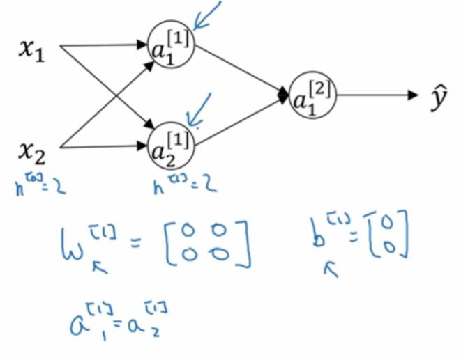
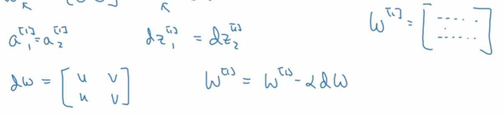
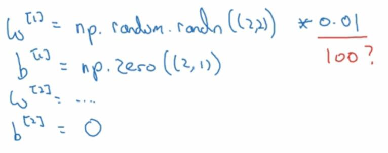
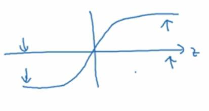

# 3.11 随机初始化

> 视频：<https://mooc.study.163.com/learn/deeplearning_ai-2001281002?tid=2001392029#/learn/content?type=detail&id=2001702021>

训练神经网络时，随机初始化权重非常重要。对于 logistic 回归，可以将权重全部初始化为零。但对于神经网络，如果把权重全部初始化为零，再使用梯度下降，就会完全无效。

假设你有两个输入特征，两个隐藏单元。如果你把隐层相关的值`W^[1]`初始化为零，对于任何输入，你的`a^[1]_1`和`a^[1]_2`就是一样的。这两个隐藏单元在做完全一样的计算。

然后，你的`dz^[1]_1`和`dz^[1]_2`也是一样的，这就是所谓的完全对称。

于是，我们的`dW`的每一行也都是一样的，我们使用`dW`来更新`W^[1]`，然后`W^[1]`每一行也是一样的。

所以，由归纳法可得，如果你把`W`初始化为零，在神经网络的训练过程中，每个隐藏单元做的计算完全一样。

这个问题的解决方案时随机初始化所有的参数。我们可以将`W`设置成随机值，然后乘上一个非常小的值，比如`0.01`。`b`是全零是没问题的。

这样做是因为，如果你的权重很大，`Z`就很大，就会落在 sigmoid 函数的平缓部分，梯度下降就会非常慢。

如果你的网络中没有 sigmoid 或者 tanh 函数，那就没有关系。如果你的网络在做二元分类，并且用了 sigmoid 当做激活函数，初始参数就不要太大。

存在其它好用的常数。如果你训练浅层神经网络，0.01 应该还可以。如果是深层的，可能需要试试别的常数。后面会讲什么时候选用其它常数。
