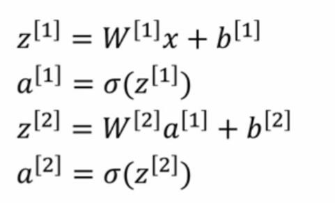
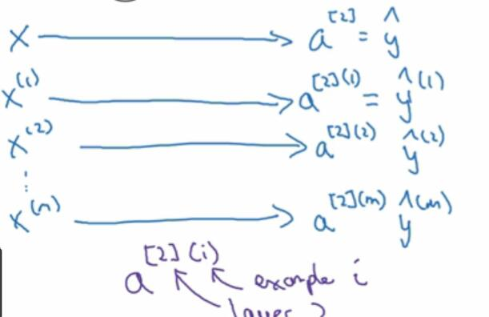
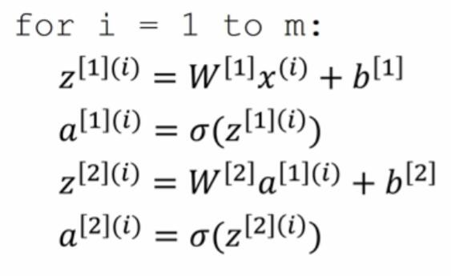
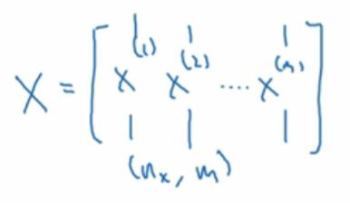
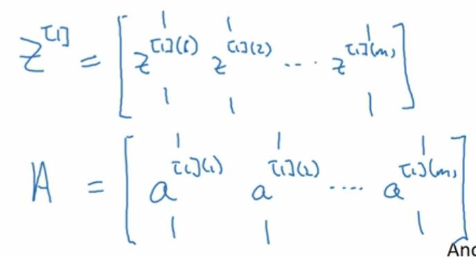
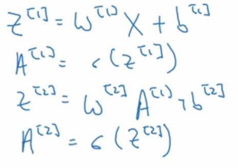

# 3.4 多个例子中的向量化

> 视频：<https://mooc.study.163.com/learn/deeplearning_ai-2001281002?tid=2001392029#/learn/content?type=detail&id=2001702015>

这是上节课的四个方程（`W`的行是`W^[1]_j`，`x`是单个样本）：

现在，如果你有`m`个训练样本，如果没有向量化，你需要重复这个过程。使用`x^(i)`计算`a^[2](i)`：

使用一个`for`循环，就是：

如果我们将整个计算过程向量化，就不用这么麻烦。

我们将`X`表示为这样，列是样本，行是特征：

其实就是把`x^(i)`纵向堆叠，`z^[l](i)`和`a^[l](i)`也是一样：

然后就可以去掉上角标`(i)`并变成大写。

对于这些矩阵`X`、`A`和`Z`，列索引`(i)`是样本下标，行索引`j`是节点（或特征）的下标。

比如，矩阵`A^[1]`左上角那个值，`A^[1](1)_1`，对应于隐层第一个节点的第一个样本的激活值。

如果我们横向移动，我们会遍历不同的样本，纵向移动，我们会遍历不同的节点。
