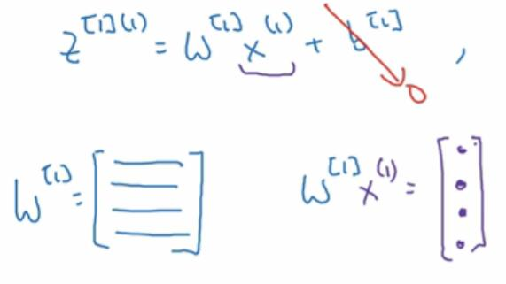
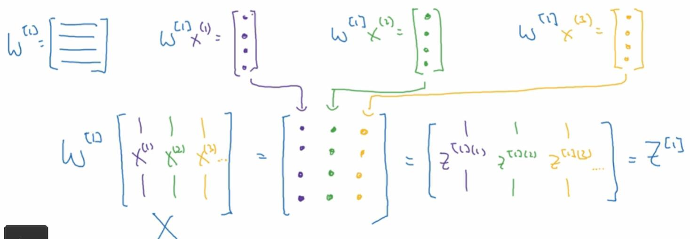

# 3.5 向量化实现的解释

之前，我们把训练样本横向堆叠成了矩阵`X`，来推导神经网络的正向传播实现。这里是一些更多的解释，为什么我们写下的方程是正确的向量化实现。

我们先拿出来一个样本来看，为了简便起见，我们把`b`去掉。实际上可以将`b`整合进`w`里面，这样可以极大减少运算量。

这里的`W^[1]`是一个矩阵，每一行是`w^[1]_j`。它乘以`x^(1)`后会得到一个列向量，也就是`z^[1](1)`，每个元素是`z^[1](1)_j`。其余的每个样本都是这样。

现在我们考虑将`x^(i)`按列堆叠成`X`，然后左乘`W^[1]`。因为它在矩阵乘法的右边，所以结果也会按列堆叠。结果的第`i`列`z^[1](i) = W^[1]x^(i)`。

接下来考虑`b`，如果你把`b`单独列了出来，我们需要将`b`加回去。`b`是一个`n_nodes x 1`的列向量。我们将其与`W^[1]X`相加，`b`的每行会与之对齐，列会广播。
