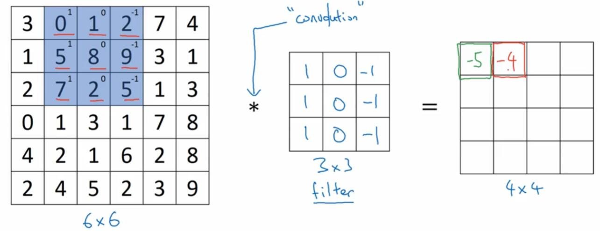

# 4.1 卷积和卷积层

## 卷积

卷积是 CNN 里面的基本操作，可以说十分重要。

假设我们有一个`6x6`的矩阵`a`，还有一个`3x3`的矩阵`b`，它们的卷积应该是`4x4`的矩阵。计算卷积的步骤是这样：

首先将`b`移动到`a`上面，盖住左上角，逐项相乘再相加。

然后，将`b`右移一格，进行相同运算。

经过四次计算后，`b`应该到达了最右边。

然后，我们将`b`换行，下移一格，然后移到最左边。

重复以上操作，当`b`到达右下角时，就计算完成了。

准确来说，这里的卷积是`Valid`（有效）模式的，后面我们会看到不同的模式。

## 数学上的注解

在数学上，`*`（星号）是卷积的标准符号，但是在 Python 中，星号用于逐元素相乘。在这个笔记里，符号的含义会特殊说明，或者为其另选符号。

在数学上，离散卷积的定义是，如果`c`是`a * b`，那么`c[i + j] += a[i] * b[j]`。其中，`c[0] = a[0] * b[0]`，`c[1] = a[0] * b[1] + a[1] * b[0]`，以此类推。也就是说，卷积操作在移动之前，首先要把矩阵水平翻转，再竖直翻转。

深度学习中的卷积没有这个步骤（不过一些核是对称的，翻转与否没有区别），但要注意，它不具备数学上的卷积交换律，`a * b = b * a`。

## 模式

我们假设两个矩阵是`nxn`和`fxf`的。准确来讲，根据任务的不同，存在不同的卷积模式。

+   `Valid`（有效）：就是上面这种计算方式。较小矩阵必须被较大矩阵完全覆盖。所得矩阵的尺寸是`n - f + 1`。

+   `Full`（完整）：不要求完全覆盖，只要有`1x1`的覆盖就能计算，没有覆盖的格子都是零。所得矩阵的尺寸是`n + f - 1`。这个就是多项式乘法中的模式。

+   `Same`（等同）：这个比较谜，是从`Full`模式的所得矩阵中，剪裁掉一些边距，使其强行和原矩阵之一尺寸相同。因为它可以保持图像的大小，所以广泛用于滤镜。

`Same`模式相当于从`Full`模式的所得矩阵中，剪裁掉`(f-1)/2`的边距。`Valid`模式相当于剪裁掉`f-1`的边距。

## 填充

换个角度看，如果我们为（较大的）原矩阵填充几条边，`Valid`模式就能变成`Same`甚至`Full`模式。比如，填充`(n-1)/2`条边，就能回到`Same`模式。

我们的`a`和`b`的例子中，`(n-1)/2 = (3-1)/2 = 1`。所以我们填充一个边距，所得矩阵大小为`(6+2*1) - 3 + 1 = 6`，大小就不变了。当然，填充的边距中的数必须为零。

## 步长

## 边缘检测

我们可以使用一些卷积核，对图像执行卷积操作，来实现边缘检测。

下面这个东西叫做数值 Prewitt 卷积核（有时候也叫算子）。

$$
\begin{bmatrix}1 & 0 & -1 \\ 1 & 0 & -1 \\1 & 0 & -1 \end{bmatrix}
$$

它的作用原理，可以这样来看。假设我们有一个`6x6`的灰度图像（左边），它用矩阵表示，数值越大的像素就越亮。

这个图像的渲染效果在它正下方。一眼扫过去，可以看到图片由亮变暗。我们对其使用刚才那个卷积核，结果是右边那个矩阵。可以看到，这个边缘被检测出来了，在所得矩阵中以正值标出。

但如果由暗变亮会如何呢？我们看到，结果为负值。

同时，也存在水平 Prewitt 卷积核，就是竖直版的转置：

$$
\begin{bmatrix}1 & 1 & 1 \\ 0 & 0 & 0 \\ -1 & -1 & -1 \end{bmatrix}
$$

我们综合两种变化来看一个例子：

首先可以看出，由亮变暗的边界是正值，反之为负值，这和上面的结果一致。然后中间的数值略小，这是因为计算它的时候，既有亮变暗，也有暗变亮，会受到干扰。如果图像足够大，那么`10`和`-10`还是各自两个，`30`和`-30`会更多。

其它卷积核也是存在的，比如 Sobel：

$$
\begin{bmatrix}1 & 0 & -1 \\ 2 & 0 & -2 \\1 & 0 & -1 \end{bmatrix}
$$

Scharr：

$$
\begin{bmatrix}3 & 0 & -3 \\ 10 & 0 & -10 \\3 & 0 & -3 \end{bmatrix}
$$

通过转置可以得到它们的水平或竖直版本。

另外卷积核还有 45°（上）和 135°（下）的版本：

$$
\begin{bmatrix}1 & 1 & 0 \\ 1 & 0 & -1 \\ 0 & -1 & -1 \end{bmatrix}
$$

$$
\begin{bmatrix}0 & 1 & 1 \\ -1 & 0 & 1 \\ -1 & -1 & 0 \end{bmatrix}
$$

## 卷积层

